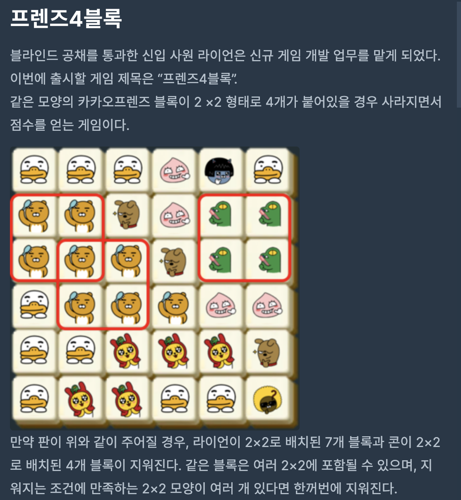

## 프렌즈 4블록



<br>

1️⃣ 우선 4칸의 영역이 겹치는지 검사가 필요하다. 즉 제거되어야 할 영역일지의 검사하는 로직이 필요하다.

```swift
func check(m: Int, n: Int, board: [[String]]) -> [[Bool]] {
  var isEliminate: [[Bool]] = Array(repeating: Array(repeating: false, count: n), count: m)
  // 3가지의 방향으로 현재 Index의 퍼즐과 같은지 확인을 위해 선언
  let direction: [[Int]] = [[0, 1], [1, 0], [1, 1]]

  // 3가지의 방향을 확인하기 위해 m-1, n-1까지만 확인 필요
  for indexI in 0..<board.count-1 {
    for indexJ in 0..<board[indexI].count-1 {
      if board[indexI][indexJ] == " " { continue }
      var sameCount = 0
      for eachDirection in direction {
        if board[indexI][indexJ] == board[indexI+eachDirection[0]][indexJ+eachDirection[1]] { sameCount += 1 }
        else { break }
      }
			
      // 3방향이 모두 같을 시, sameCount는 3이 된다.
      // 이때, 블록을 모두 삭제해야한다고 True로 설정한다.
      if sameCount == 3 {
        isEliminate[indexI][indexJ] = true
        for eachDirection in direction { isEliminate[indexI+eachDirection[0]][indexJ+eachDirection[1]] = true }
      }
      // 이후 블록 확인을 위해 0으로 초기화
      sameCount = 0
    }
  }
  return isEliminate
}
```

<br>

2️⃣ 지워야 된다고 표시된 블럭을 공백으로 바꾸어주기

```swift
for indexI in 0..<checkList.count {
  for indexJ in 0..<checkList[indexI].count {
    if checkList[indexI][indexJ] { board[indexI][indexJ] = " " }
  }
}
```

<br>

3️⃣ 공백으로 표시된 블록들을 한칸씩 당기면서 블록 채워주기

```swift
func fillBoard(_ checkList: [[Bool]], _ board: [[String]]) -> [[String]] {
	// 한칸씩 돌면서 공백인 블럭 확인
  for indexRow in 0..<board.count {
    for indexCol in 0..<board[indexRow].count {
      
      if checkList[indexRow][indexCol] && indexRow != 0 {
        // 윗칸부터 한칸씩 땡겨오는 코드, 떙겨 온 블럭은 공백으로 처리
        for indexK in (0...indexRow-1).reversed() {
          board[indexK+1][indexCol] = board[indexK][indexCol]
          board[indexK][indexCol] = " "
        }
      }
    }
  }
  return board
}
```

<br>

4️⃣ 이 과정을 지워야하는 코드가 없을 때까지 반복한다.

```swift
var flag: Bool = true
var count: Int = 0
while flag {
  flag = false
  // 4칸의 영역이 겹치는지 검사
  let checkList = check(m: m, n: n, board: tempBoard)
	
  // 하나라도 지워야하는 칸이 존재할 때 다시 반복할 수 있게 true로 지정
  // 지워야하는 칸의 수를 셀 수 있게 count++
  for indexRow in 0..<m {
    for indexCol in 0..<n {
      if checkList[indexRow][indexCol] {
        flag = true
        count += 1
      }
    }
  }
  // 4칸의 영역이 삭제되는 부분 공백으로 채우기
  tempBoard = fillBoard(checkList, tempBoard)
}
```

