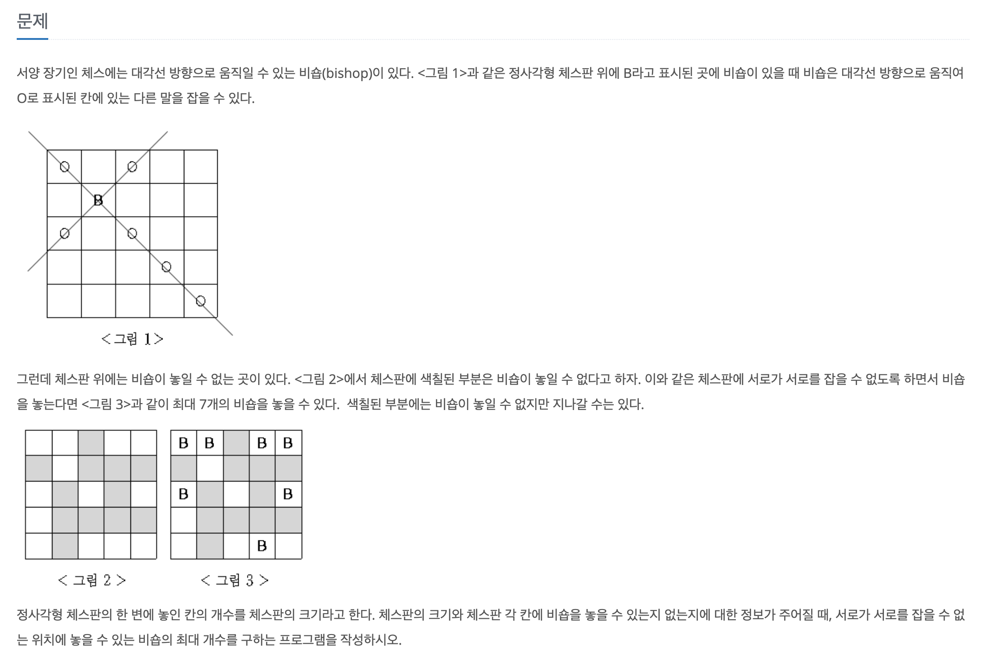

## 백준 1799 비숍 DFS 풀이



 처음에 문제를 풀 때, 흰색 판과, 검은 판을 나누지 않고 풀어서 문제가 풀리지 않았다. 보통은 시간초과가 나서 실패하는데... 로직이 아예 잘못되어서 잘못풀었던 것 같다.

 이후 흰색 판과 검은 판을 나누어 풀면 시간 복잡도가 줄어든다는 해설을 보고 한번 따라서 로직을 설계하고 실행해보았다.

 비숍의 경우 대각선으로만 움직일 수 있기 때문에 각 판을 나누어서 검사하는게 시간 복잡도 면에서 log 단위로 줄어서 더 효율적이었다.

<br>

✔️ 검은 판은 행, 열이 모두 짝수 또는 홀수인 경우에만 검은 판으로 취급했다.

✔️ 흰색 판은 행, 열이 서로 짝수, 홀수 서로 반대일 경우에만 흰색 판으로 취급했다.

<br>

1️⃣ 제일 처음 흑색 판 행, 열을 계산하여 탐색 | 제일 처음 백색 판 행, 열을 계산하여 탐색

> 👉 **흑색판** : (0, 0)
>
> 👉 **백색판** : (0, 1)

2️⃣ 한 단계 진행할 때마다 흑, 백 판이기 때문에 각각 두 칸씩 이동하면서 진행한다.

3️⃣ 각 칸에 비숍을 놓을 수 있는 칸인지 검사한다(1인지) | 대각선 방향으로 비숍이 놓여있는지 검사한다 | 이미 방문한 칸인지 검사한다.

4️⃣ 검사에서 놓을 수 있는 칸일 때, 백트래킹 방법이기 떄문에 놓는 경우와 안 놓는 경우가 있기 때문에 모두 탐색할 수 있게 한다.

<br>

✅ ***전체 코드***

```java
import java.io.BufferedReader;
import java.io.InputStreamReader;
import java.io.IOException;

public class BAEKJOON1799 {
  static int max_Black = 0;
  static int max_White = 0;
  static int[][] map;
  static int n;

  public static void main(String[] args) throws IOException {
    BufferedReader br = new BufferedReader(new InputStreamReader(System.in));

    n = Integer.parseInt(br.readLine());
    map = new int[n][n];

    for(int i = 0; i < n; i++) {
      String[] input = br.readLine().split(" ");
      for(int j = 0; j < n; j++) {
        map[i][j] = Integer.parseInt(input[j]);
      }
    }

    boolean[][] visited = new boolean[n][n];
    dfs_black(visited, 0, 0);
    dfs_white(visited, 0, 1);

    System.out.println(max_Black + max_White);
  }

  static void dfs_white(boolean[][] visited, int currentRow, int currentCol) {
    if (currentCol >= n) {
      currentCol = (currentRow+1) % 2 == 0 ? 1 : 0;
      currentRow++;
    }

    if (currentRow >= n) {
      int m = 0;
      for(int i = 0; i < n; i++) {
        for(int j = 0; j < n; j++) {
          if (visited[i][j]) { m++; }
        }
      }

      if (max_White < m) { max_White = m; }
      return;
    }

    if(!visited[currentRow][currentCol] && map[currentRow][currentCol] == 1 && searchArroundBishop(visited, currentRow, currentCol)) {
      visited[currentRow][currentCol] = true;
      dfs_white(visited, currentRow, currentCol);
      visited[currentRow][currentCol] = false;
    }

    dfs_white(visited, currentRow, currentCol+2);
  }

  static void dfs_black(boolean[][] visited, int currentRow, int currentCol) {
    // Row, Col 모두 짝수 또는 홀수인 경
    if (currentCol >= n) {
      currentCol = (currentRow+1) % 2 == 0 ? 0 : 1;
      currentRow++;
    }

    if (currentRow >= n) {
      int m = 0;
      for(int i = 0; i < n; i++) {
        for(int j = 0; j < n; j++) {
          if (visited[i][j]) { m++; }
        }
      }

      if (max_Black < m) { max_Black = m; }
      return;
    }

    if (!visited[currentRow][currentCol] && map[currentRow][currentCol] == 1 && searchArroundBishop(visited, currentRow, currentCol)) {
      visited[currentRow][currentCol] = true;
      dfs_black(visited, currentRow, currentCol+2);
      visited[currentRow][currentCol] = false;
    }

    dfs_black(visited, currentRow, currentCol+2);
  }

  static boolean searchArroundBishop(boolean[][] visited, int currentRow, int currentCol) {
    int[][] direction = {{-1, -1}, {-1, 1}, {1, -1}, {1, 1}};

    for(int i = 1; i < n; i++) {
      for(int j = 0; j < 4; j++) {
        int nextRow = currentRow + i * direction[j][0];
        int nextCol = currentCol + i * direction[j][1];
        if(nextRow >= 0 && nextRow < n && nextCol >= 0 && nextCol < n && visited[nextRow][nextCol]) {
          return false;
        }
      }
    }
    return true;
  }
}

```


