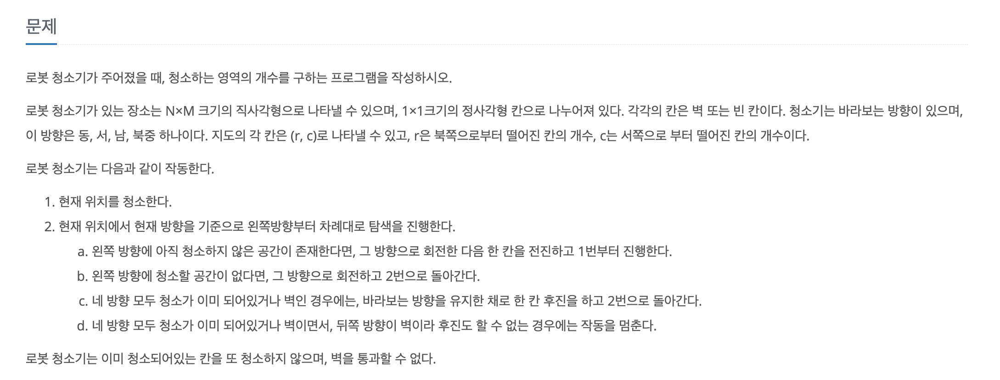

## 백준 14503 로봇 청소기 BFS 풀이



<br>

 우선 DFS, BFS을 사용하여 모두 풀이할 수 있다. 나는 BFS가 편하기 때문에 BFS을 선택하여 풀이하였다. 동작을 위해 몇 가지의 주의하여야 할 사항이 있다.

✔️ 0, 1, 2, 3이 북, 동, 남, 서를 나타내지만 회전을 할 때는 왼쪽으로 회전하기 때문에 서, 남, 동, 북이 기준

✔️ 네 방향을 모두 청소 불가능 또는 전진 불가능하면 현재 방향을 기준으로 뒤로 후진한다.

<br>

 이렇게 두 가지 사항을 유의해서 문제를 풀어주면 크게 어려운 문제는 아니다. BFS을 사용하여 풀었기 때문에 Queue의 구조를 사용하였다.

1️⃣ 현재 방향 기준으로 왼쪽으로 돌아가면서 탐색하여 전진이 가능하면 Queue에 넣었다. 여기서 전진이 가능한 경우 `isOk`로 표시하여 후진을 할 수 없게 만들어주었다.

```java
for(int i = 3; i >= 0; i--) {
  nextDir = (tempDir+i)%4;
  nextX = tempX+direction[nextDir][1];
  nextY = tempY+direction[nextDir][0];
  if (nextY >= 0 && nextY < n && nextX >= 0 && nextX < m && map[nextY][nextX] == 0 && !visited[nextY][nextX]) {
    queueX.add(nextX);
    queueY.add(nextY);
    queueDir.add(nextDir);
    visited[nextY][nextX] = true;
    isOk = true;
    break;
  }
}
```

<br>

2️⃣ 만약 4방향 모두 막혀있거나 청소가 된 경우, 즉 `isOK`가 표시된 경우에 현재 방향을 기준으로 후진을 할 수 있게 구현하였다. 이 경우는 `visited`을 체크하지 않는다.

```java
if(!isOk) {
  nextX = tempX-direction[tempDir][1];
  nextY = tempY-direction[tempDir][0];

  if (nextY >= 0 && nextY < n && nextX >= 0 && nextX < m && map[nextY][nextX] == 0) {
    queueX.add(nextX);
    queueY.add(nextY);
    queueDir.add(tempDir);
  }
}
```

<br>

<br>

✅ ***전체 코드***

```java
import java.io.BufferedReader;
import java.io.InputStreamReader;
import java.io.IOException;
import java.util.LinkedList;

public class main {
  // 북,동,남,서
  static int[][] direction = {{-1, 0}, {0, 1}, {1, 0}, {0, -1}};

  public static void main(String[] args) throws IOException {
    BufferedReader br = new BufferedReader(new InputStreamReader(System.in));

    String[] input = br.readLine().split(" ");

    // n = 세로 크기 height, m = 가로 크기 width
    int n = Integer.parseInt(input[0]);
    int m = Integer.parseInt(input[1]);

    input = br.readLine().split(" ");
    int robotY = Integer.parseInt(input[0]);
    int robotX = Integer.parseInt(input[1]);
    int robotDir = Integer.parseInt(input[2]);

    int[][] map = new int[n][m];
    for(int i = 0; i < n; i++) {
      input = br.readLine().split(" ");
      for(int j = 0; j < m; j++) {
        map[i][j] = Integer.parseInt(input[j]);
      }
    }

    bfs(n, m, map, robotX, robotY, robotDir);
  }

  static void bfs(int n, int m, int[][] map, int currentX, int currentY, int currentDir) {
    LinkedList<Integer> queueX = new LinkedList<>();
    LinkedList<Integer> queueY = new LinkedList<>();
    LinkedList<Integer> queueDir = new LinkedList<>();

    queueX.add(currentX);
    queueY.add(currentY);
    queueDir.add(currentDir);

    boolean[][] visited = new boolean[n][m];
    visited[currentY][currentX] = true;

    while (!queueX.isEmpty()) {
      int tempX = queueX.remove(0);
      int tempY = queueY.remove(0);
      int tempDir = queueDir.remove(0);

      int nextX, nextY, nextDir;
      boolean isOk = false;

      // 현재방향부터 왼쪽으로 탐색
      for(int i = 3; i >= 0; i--) {
        nextDir = (tempDir+i)%4;
        nextX = tempX+direction[nextDir][1];
        nextY = tempY+direction[nextDir][0];
        if (nextY >= 0 && nextY < n && nextX >= 0 && nextX < m && map[nextY][nextX] == 0 && !visited[nextY][nextX]) {
          queueX.add(nextX);
          queueY.add(nextY);
          queueDir.add(nextDir);
          visited[nextY][nextX] = true;
          isOk = true;
          break;
        }
      }

      // 모든 방향을 탐색했는데, 갈 곳이 없는 경우 뒤로 후
      if(!isOk) {
        nextX = tempX-direction[tempDir][1];
        nextY = tempY-direction[tempDir][0];

        if (nextY >= 0 && nextY < n && nextX >= 0 && nextX < m && map[nextY][nextX] == 0) {
          queueX.add(nextX);
          queueY.add(nextY);
          queueDir.add(tempDir);
        }
      }
    }

    int count = 0;

    for(int i = 0; i < n; i++) {
      for(int j = 0; j < m; j++) {
        if(visited[i][j]) { count++; }
      }
    }

    System.out.println(count);
  }
}
```


